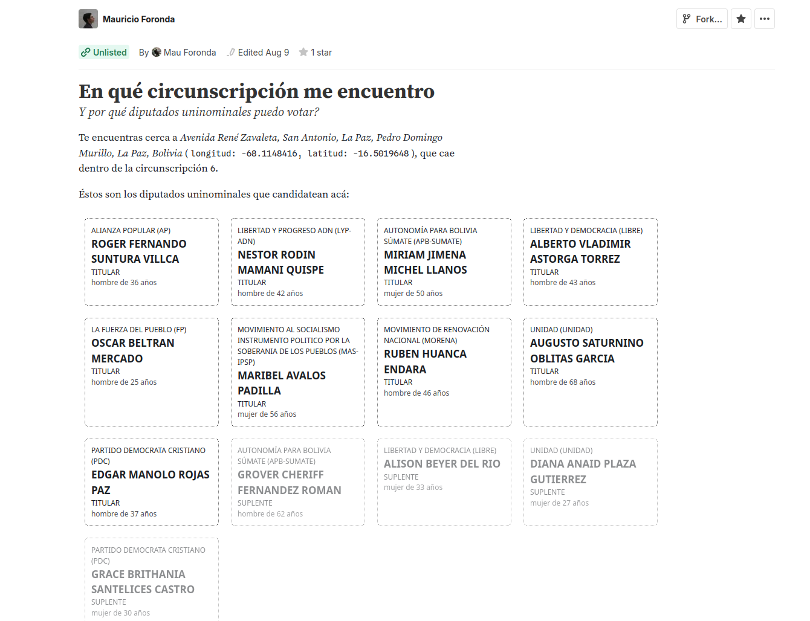

# Know your candidate to uninominal deputy (Bolivia)

The [2025 Bolivian general elections](https://en.wikipedia.org/wiki/2025_Bolivian_general_election) are in one week. We will vote for the president, senators, and deputies.

There are three kinds of deputies:

- "plurinominal": elected based on the score of their presidential candidate,
- "especial": representatives of indigenous peoples and nations,
- "uninominal": 63 local elections.

For the latter, Mauricio Foronda created a tool that gives you the list of candidates for uninominal deputy in your electoral circumscription: [En qué circunscripción me encuentro](https://observablehq.com/@mauforonda/en-que-circunscripcion-me-encuentro).

You must allow the page to use your localization (and be in Bolivia) to view the list. For me, in the center of La Paz, it's the following:

Note that I don't get the same list if I use my cellphone (4G) or my laptop (WiFi).
