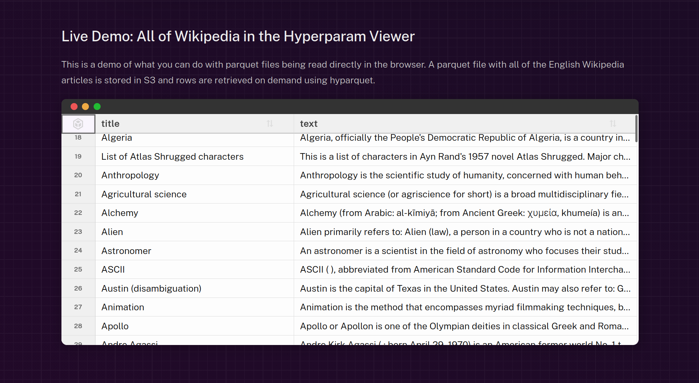

TL;DR: In this post, I present <strong>five techniques related to vertical scrolling</strong> used in `<HighTable>`, a React component that can display billions of rows in a table while keeping good performance and accessibility.

<a title="Christies.com, Public domain, via Wikimedia Commons" href="https://commons.wikimedia.org/wiki/File:A_Qur%27an_scroll_(tumar)_commissioned_for_Ghiyath_al-Din_Sultan_Muhammad_ibn_Sultan_Eretna,_signed_Mubarakshah_ibn_%27Abdullah,_eastern_Anatolia,_dated_1353-54.jpg"></a>

It's a long post, which reflects the complexity of rendering billions of rows in a table, and the amount of work we put into building the React component.

Table of contents:

- [Introduction](#introduction)
- [Demo](#demo)
- [Scrolling basics](#scrolling-basics)
- [Technique 1: lazy loading](#technique-1-lazy-loading)
- [Technique 2: table slice](#technique-2-table-slice)
- [Technique 3: infinite pixels](#technique-3-infinite-pixels)
- [Technique 4: pixel-precise scroll](#technique-4-pixel-precise-scroll)
- [Technique 5: two-step random access](#technique-5-two-step-random-access)
- [Conclusion](#conclusion)

## Introduction

Showing data in a table is one of the first exercises you'll find in HTML 101 courses.

```html
<table>
  <thead>
    <tr><th>Name</th><th>Age</th></tr>
  </thead>
  <tbody>
    <tr><td>Alice</td><td>64</td></tr>
    <tr><td>Bob</td><td>37</td></tr>
  </tbody>
</table>
```

But, as often in data science, what works for simple cases breaks when the size increases.

In this post, I'll showcase five techniques we use to <strong>solve challenges related to vertical scrolling</strong> in the `<HighTable>` React component to handle billions of rows.

The component also provides features for columns (sort, hide, resize), rows (select), cells (keyboard navigation, pointer interactions, custom rendering). Feel free to ask and look at the code if you're interested in knowing more.

The `<HighTable>` component is developed at [hyparam/hightable](https://github.com/hyparam/hightable/). It was created by [Kenny Daniel](https://github.com/platypii) for [Hyperparam](https://hyperparam.app/), and I've had the chance to contribute to its development for one year now.

This blog post was sponsored by [Hyperparam](https://hyperparam.app/). Thanks for the support and for challenging me to solve the fascinating problem of rendering billions of rows in the browser!

## Demo

Try the [hightable demo](https://hyparam.github.io/demos/hightable/#/large):

<iframe src="https://hyparam.github.io/demos/hightable/#/large" title="HighTable demo with a large dataset" width="100%" height="400px"></iframe>

HighTable is also used in the [Parquet viewer](https://hyparam.github.io/demos/hyparquet/), on [source.coop](https://source.coop/jrc-lucas/jrc-lucas-ml/ml_data/classes_dataset.csv) and in [Hyperparam](https://hyperparam.app):

<a title="Try HighTable in Hyperparam, the workbench for LLM datasets" href="https://hyperparam.app"></a>

## Scrolling basics

Before diving into the techniques, let's describe how scrolling works using a standard HTML table.

The HTML structure is composed of a scrollable container, that we call the <span class="viewport"><em>viewport</em></span>, and a <span class="table">table</span> element inside it:

```html
<div class="viewport" style="overflow-y: auto;">
  <table class="table">
    ...
  </table>
</div>
```

In this structure, the <span class="viewport">viewport</span> is a div with a fixed height and the CSS property `overflow-y: auto` enables a vertical scrollbar when the <span class="table">table</span> is taller than the <span class="viewport">viewport</span>.

In the following widget, scroll the left box up and down to see how the right box mimics the scrolling effect.

> If you use a keyboard, you can focus the left box with <kbd>Tab</kbd>, and scroll with the arrow keys <kbd>⏶</kbd> and <kbd>⏷</kbd>. Otherwise, you can use mouse wheel, drag the scroll bar, or slide on a touch screen.


<scroll-native></scroll-native>


The component is delimited by its fixed-size <span class="viewport">viewport</span> (blue border). The <span class="table"><em>table</em></span> (golden border) is rendered inside the container. As its <span class="table">height</span> is larger than the <span class="viewport">viewport height</span>, only part of the table is visible, and a vertical scrollbar lets changing the visible part. <strong>The inner <span class="table">table</span> element moves up and down within the <span class="viewport">viewport</span></strong>, creating the scrolling effect.

On the right side, we mimic the scrolling effect, showing the position of the <span class="table">table</span> relative to the <span class="viewport">viewport</span>.

Let's settle some definitions and formulas that will be useful later:

1. in this post, we assume <code><span class="viewport">viewport</span>.clientHeight</code>, the height of the visible area, is constant. In hightable, we measure it and react to resizing.

2. <code><span class="viewport">viewport</span>.scrollHeight</code>, the total height of the scrollable content, is equal to <code><span class="table">table</span>.clientHeight</code>. Both are equal to the number of rows in the table multiplied by the row height:

    ```typescript
    const rowHeight = 33 // in pixels
    const numRows = data.numRows // total number of rows in the table
    const height = numRows * rowHeight
    ```

    In this post, we assume the row height and the number of rows are constant. In hightable, we react to changes in <code>data.numRows</code> (the number of rows in the <em>data frame</em>, the data structure holding the table data), for example when filtering; but we assume the row height is fixed (see [issue #395](https://github.com/hyparam/hightable/issues/395) to support variable row heights).

3. <code><span class="viewport">viewport</span>.scrollTop</code> is the number of pixels between the top of the scrolled <span class="table">table</span> and the top of the <span class="viewport">viewport</span>. The minimum value <code>0px</code> shows the top of the table, while the bottom of the table is reached at the maximum value <code><span class="viewport">viewport</span>.scrollHeight - <span class="viewport">viewport</span>.clientHeight</code>.

4. The visible pixels can be computed from the <span class="viewport">viewport</span> scroll top position:

    ```typescript
    const firstVisiblePixel = viewport.scrollTop
    const lastVisiblePixel = viewport.scrollTop + viewport.clientHeight
    // firstVisiblePixel is inclusive, lastVisiblePixel is exclusive
    ```

Now that we have the basics, let's see how to handle large datasets.

## Technique 1: lazy loading

The first challenge when working on a large dataset is that it will not fit in your browser memory. The good news: you'll not want to look at every row either, and not at the same time. So, instead of loading the whole data file at start, we <strong>only load the visible cells</strong>.

> Note that lazy loading the data does not change the HTML structure of the table.

The following widget shows how lazy loading works. Scroll the left box up and down to see how the cells are loaded on demand on the right side:


<scroll-lazy-load></scroll-lazy-load>


In the <span class="table">table</span>, only the visible cells are loaded. When scrolling, newly visible cells are requested and loaded in the background, and rendered when available.

To do so, we compute the visible rows, and only load them:

```typescript
const rowStart = Math.floor(firstVisiblePixel / rowHeight)
const rowEnd = Math.ceil(lastVisiblePixel / rowHeight)
// rowStart is inclusive, rowEnd is exclusive
```

In hightable, the data loading logic is handled in a <em>data frame</em>, passed to the React component as the `data` prop:

```jsx
<HighTable data={data} />
```

The data frame is an object that defines how to load (i.e. fetch and cache) the data on demand, and how to get the loaded data for rendering. See the `DataFrame` TypeScript definition in [types.ts](https://github.com/hyparam/hightable/blob/b171cd35a61253cb2b090f60c83c9aa660bf27fb/src/helpers/dataframe/types.ts#L50).

Here is a simplified DataFrame implementation that generates random data for one column, applying some delay to simulate fetching data over the network, and persists the values in memory:

```javascript
const cache = new Map()
const eventTarget = new EventTarget()
const numRows = 1_000_000

const data = {
  numRows,
  eventTarget,

  // Synchronously return the cached value (if any)
  getCell({ row }) {
    return cache.get(row);
  },

  // Load missing values for the given rows, and cache them
  async fetch({ rowStart, rowEnd }) {
    // Simulate network delay
    await new Promise((resolve) => setTimeout(resolve, 100));
    for (let row = rowStart; row < rowEnd; row++) {
      // Skip already cached rows
      if (cache.has(row)) continue;
      // Generate a random value for the cell, and cache it
      cache.set(row, {value: Math.random()});
    }
    // Emit an event to tell <HighTable> to re-render the visible cells
    eventTarget.dispatchEvent(new Event('resolve'));
  },
}
```

The data frame loads the data from the source using the asynchronous `data.fetch()` method. It must cache the results, and dispatch a `resolve` event when new data is available. The source can be anything. In our example, the data was randomly generated. It can also be obtained from a [local file](https://developer.mozilla.org/en-US/docs/Web/API/File), an in-memory array, a remote file (using HTTP range requests), or a REST API, to name a few examples.

The data frame must also provide a synchronous `data.getCell()` method to get the cached data for a given cell, or `undefined` if the data is not loaded yet.

On every scroll move, the table is rendered, calling `data.getCell()` for the visible rows, as well as `data.fetch()` to load them in the background if necessary (it's the responsibility of the data frame to return fast if the data is already cached). Every time new data is fetched and reported (on  `resolve` events), the table will be re-rendered.

> You can find a more complete example of a data frame that loads a remote Parquet file (using HTTP range requests) in the [hyparquet demo](https://github.com/hyparam/demos/blob/8cbaf815eb75af0699d44242be2cfb2756b02ce7/hyparquet/src/App.tsx#L23).

The data frame structure is not oriented towards rows or columns, and allows loading and accessing the data by cell. Currently, in hightable, we load full rows, but we could improve by computing the visible columns and loading them lazily as well. Join the pending [discussion](https://github.com/hyparam/hightable/issues/297) if you're interested in this feature.

### Impact of lazy loading

If we assume 10 billions of rows, and 100 bytes per row, the <strong>total data size is 1TB</strong>. Loading it all in memory is not possible, but with lazy loading, <strong>we only load 3KB</strong> for the visible part (about 30 rows at a time), and keep good performance.

Lazy loading the data is the first step, required to handle large datasets in the browser. The next step is to avoid rendering too many HTML elements at once.

## Technique 2: table slice

In software engineering, when you try to optimize, the first step is to remove computing that does nothing. In our case, if the table has one million rows and we can see only 30 at a time, why render one million `<tr>` HTML elements? As a reference, Chrome [recommends](https://developer.chrome.com/docs/performance/insights/dom-size) creating or updating less than 300 HTML elements for optimal responsiveness.

In the `<HighTable>` component, <strong>only the visible slice of the table is rendered</strong>. The other row elements simply don't exist.

To achieve this, the HTML structure must be adapted, by adding an intermediate div element, that we call the <span class="canvas">canvas</span>, between the <span class="viewport">viewport</span> and the <span class="table">table</span>:

```html
<div class="viewport" style="overflow-y: auto;">
  <div class="canvas" style="position: relative; height: 30000px;">
    <table class="table" style="position: absolute; top: 3000px;">
      <!-- the table only renders the visible rows -->
      ...
    </table>
  </div>
</div>
```

The HTML structure will remain the same for the rest of the blog post, including techniques 3, 4 and 5.

> The <span class="canvas">canvas</span> div is not related at all with the `<canvas>` HTML element. I'm open to suggestions for better naming if it's confusing.

The <span class="canvas">canvas</span> is sized so that it could contain all the rows:

```typescript
canvas.style.height = `${data.numRows * rowHeight}px`
```

It sets the <span class="viewport">viewport</span> scrollbar to the expected size. As shown in the scrolling basics section, <code><span class="viewport">viewport</span>.scrollHeight</code> is equal to <code><span class="canvas">canvas</span>.clientHeight</code>.

The <span class="canvas">canvas</span> serves as a reference for absolutely positioning the <span class="table">table</span> slice.

The following widget shows how table slicing works. Scroll the left box up and down to see how the right box mimics the scrolling effect, while rendering only the visible rows. Toggle the <span class="full-table">full table</span> button to see how the rendered rows fit in the full table:


<scroll-slice></scroll-slice>


On the right side, you see that only the visible rows are rendered. The <span class="table">table</span> slice contains 6 rows instead of 10 (or 7, depending on the scroll position).

The HTML structure inside the <span class="table">table</span> slice is:

```html
<table>
  <tbody>
    <!-- Rows 0 to 99 are not rendered -->

    <!-- Visible rows -->
    <tr>...row 100...</tr>
    <tr>...row 101...</tr>
    ...
    <tr>...row 119...</tr>

    <!-- Rows 120 to 999 are not rendered -->
  </tbody>
</table>
```

Let's assume the <span class="full-table">data</span> has 1,000 rows, each row in the table is 30px height, and the <span class="viewport">viewport</span> height is 600px (so that about 20 rows are visible at once). If the user has scrolled down 3,000px, `<HighTable>` only renders rows 100 to 119 in the actual `<table>` <span class="table">element</span>.

> The HTML above is a simplification. In [hightable](https://github.com/hyparam/hightable/blob/b171cd35a61253cb2b090f60c83c9aa660bf27fb/src/components/HighTable/Slice.tsx#L177), we render a table header and add some padding rows before and after the visible rows to improve the scrolling experience.

The <span class="table">table</span> top position is adjusted to fit in the <span class="full-table">full table</span> (toggle the <span class="full-table">Show</span> / <span class="full-table">Hide</span> button to render the full table). It's equals to the position of the first visible row inside the virtual <span class="full-table">full table</span>. It's nearly equal to <code><span class="viewport">viewport</span>.scrollTop</code>, but differs by the amount of hidden pixels at the top of the first visible row. So:

```typescript
table.style.top = `${
  viewport.scrollTop - (viewport.scrollTop % rowHeight)
}px`;
```

These computations are done on every scroll event (and on every other change: when the <span class="viewport">viewport</span> height changes, or when the number of rows is updated). Once computed, the <span class="table">table slice</span> is re-rendered with the new visible rows, the <span class="table">table</span> position is updated with the new `top` value, and the data frame is queried to load the new visible cells if needed.

> A detail worth mentioning is the sticky header. In `<HighTable>`, the header with column names is rendered as part of the <span class="table">table</span> element, in `<thead>`, not as a separate element. It helps with accessibility, as screen readers can easily identify the header cells associated with each data cell, and with columns resizing, as the header and data cells are aligned automatically by the browser. Thanks to the CSS property `position: sticky` (see [sticky](https://developer.mozilla.org/en-US/docs/Web/CSS/Reference/Properties/position#sticky) on MDN), the header row remains visible at the top of the <span class="viewport">viewport</span> when scrolling. We take it into account to compute the first visible row.

Note that the table slicing technique is not specific to vertical scrolling. The same approach can be used for horizontal scrolling (rendering only the visible columns). It's less critical, as tables generally have less columns than rows. Join the pending [discussion on virtual columns](https://github.com/hyparam/hightable/issues/297) if you're interested in this feature.

### Impact of table slice

If we assume 10 billions of rows, and 30 rows are visible at a time, <strong>we only render 30 HTML elements instead of 10 billion</strong>. It allows to keep good performance with any number of rows, as <strong>the number of rendered elements is constant</strong>.

Until now, everything is pretty standard. The next techniques are more specific to hightable, and address challenges that arise when dealing with billions of rows.

## Technique 3: infinite pixels

Technique 2 works perfectly, until it breaks... As Eric Meyer explains in his blog post [Infinite Pixels](https://meyerweb.com/eric/thoughts/2025/08/07/infinite-pixels/), HTML elements have a maximum height, and the exact value depends on the browser. The worst case is Firefox: about 17 million pixels. As the <span class="canvas">canvas</span> height increases with the number of rows, if the row height is 33px (the default in hightable), we cannot render more than 500K rows.

Our approach to this issue in hightable is to <strong>set a maximum height for the <span class="canvas">canvas</span> and downscale the scrollbar resolution above this limit.</strong> In hightable, the threshold is set to 8 million pixels.

Concretely, above the threshold, one scrolled pixel corresponds to multiple pixels in the <span class="full-table">full table</span>. The downscaling factor is the ratio between the theoretical height of the <span class="full-table">full table</span> and the maximum height of the <span class="canvas">canvas</span>. Thanks to that factor, if you scroll half the scrollbar, you reach the middle of the <span class="full-table">full table</span>, no matter how big it is.

Below the threshold, the downscaling factor is 1, so everything works as before: one scrolled pixel corresponds to one pixel in the <span class="full-table">full table</span>.

The downscale factor is computed as:

```typescript
const fullTableHeight = data.numRows * rowHeight
const maxCanvasHeight = 8_000_000
if (fullTableHeight <= maxCanvasHeight) {
  downscaleFactor = 1
} else {
  downscaleFactor = 
    (fullTableHeight - viewport.clientHeight) /
    (maxCanvasHeight - viewport.clientHeight)
}
```

Now, the first visible row is computed with:

```typescript
firstVisibleRow = Math.floor(
  (viewport.scrollTop * downscaleFactor) / rowHeight
)
```

and the <span class="table">table</span> top position is set to align the first visible row with the top of the <span class="viewport">viewport</span>:

```typescript
table.style.top = `${viewport.scrollTop}px`;
```

This lets the user navigate through the whole table, even with billions of rows.

The following widget shows how scrollbar downscaling works. Scroll the left box up and down to see how the right box mimics the scrolling effect, allowing to navigate through ten billion rows.


<scroll-downscale></scroll-downscale>


But there is a drawback. The native scroll bar precision is limited to 1 <em>physical</em> pixel. On "high-resolution" screens, the apparent precision is a fraction of a <em>CSS</em> pixel (1 / [devicePixelRatio](https://developer.mozilla.org/en-US/docs/Web/API/Window/devicePixelRatio)). But let's keep one pixel for simplicity.

> As an anecdote, setting the scroll value programmatically is hard to predict. It depends on the device pixel ratio, which itself depends on the zoom, and maybe other factors. For example, `element.scrollTo({top: 100})` might result in `scrollTop = 100`, `scrollTop = 100.23`, or `scrollTop = 99.89`. You cannot know exactly, but within a margin of one pixel.
>
> The scrollTop value can even be outside of the expected range, for example negative or larger than the maximum value `scrollHeight - clientHeight`. To prevent such browser-specific over-scroll effects, when reacting to a scroll event, hightable always clamps the `scrollTop` value within the expected range, and applies the CSS rule `overflow-y: clip`. `clip`, instead of `hidden`, shows the sticky header, even if I'm not sure why to be honest.

So, when the downscale factor is big, like in the example above (2,189,781,021), the minimal scroll move (1px) corresponds to 2,189,781,021 pixels in the full table. With a row height of 30px, it means that the minimal scroll move corresponds to about 72,992,701 rows. It creates <em>gaps</em> in the reachable rows:

- if <code><span class="viewport">viewport</span>.scrollTop = 0</code>, the visible rows are 0 to 5
- if <code><span class="viewport">viewport</span>.scrollTop = 1</code>, the visible rows are 72,992,700 to 72,992,705
- if <code><span class="viewport">viewport</span>.scrollTop = 2</code>, the visible rows are 145,985,401 to 145,985,406
- and so on...

There is no way to navigate to the rows 6 to 10, for example. Setting <code><span class="viewport">viewport</span>.scrollTop = 0.00000000274</code> to reach rows 6 to 10 is impossible, because the browser rounds the scroll position to the nearest integer pixel.

### Impact of infinite pixels

If we assume 10 billions of rows, the infinite pixels technique allows to navigate through the whole rows span. <strong>There is no limit to the number of rows</strong>, as we can always increase the downscale factor to fit in the maximum canvas height.

But due to the limited scrollbar precision, if the row height is 30px and the canvas is 8Mpx, each scrolled pixel moves the table by 1,250 rows. It means that <strong>only one row (and its neighbors) out of 1,250 is reachable</strong>.

The infinite pixels technique thus provides global navigation through billions of rows. But it does not allow fine scrolling, and some rows are unreachable. The technique 4 addresses this issue.

## Technique 4: pixel-precise scroll

The previous technique allows to scroll globally through the file, but prevents users from scrolling locally because any scroll gesture will jump over gaps of unreachable rows.

To fix that, we implement <strong>two scrolling modes: local and global scrolling</strong>. Local scrolling means scrolling the table slice pixel by pixel (i.e. even more precisely than row by row), while global scrolling means jumping to the position given by the scrollbar.

The logic requires a state with three values: `{ scrollTop, globalAnchor, localOffset }`
- the last <span class="viewport">viewport</span> scroll top value is stored in the state to compute the scroll move on every scroll event.
- the global anchor is the <span class="viewport">viewport</span> scroll top value corresponding to the last global scroll. It is updated on every global scroll, but not on local scrolls.
- the local offset is the offset applied to the global anchor to compute the current scroll position. It is updated on every local scroll, and reset to 0 on global scrolls.

The first visible row is computed from the global anchor and the local offset:

```typescript
const firstVisibleRow = Math.floor((
    state.globalAnchor * downscaleFactor + state.localOffset
  ) / rowHeight)

```

The absolute positioning of the <span class="table">table</span> is now:

```typescript
table.style.top = `${viewport.scrollTop + state.localOffset}px`;
```

On every scroll event, we compute the magnitude of the scroll move (difference between the new <span class="viewport">viewport</span>'s scroll top and the previous one, stored in the state) and decide to apply:

- a <b>global scroll</b> if the scroll move is big, typically on scrollbar drag and drop, and we jump to the new global position (technique 3),
- or a <b>local scroll</b> if the scroll move is small, for example when using the mouse wheel. In that case, we keep the state's `globalAnchor` value unchanged (ie: not sync'ed anymore with the real `scrollTop` value) and adjust the `localOffset` so that the move appears local (for example, 3 rows downwards).

Represented as code, the logic looks like this (simplified, pseudo-code):

```typescript
const state = getState()
const delta = viewport.scrollTop - state.scrollTop
if (Math.abs(delta) > localThreshold) {
  // global scroll
  state.localOffset = 0
  state.globalAnchor = viewport.scrollTop
} else {
  // local scroll
  state.localOffset += delta
}
setState(state)
```

Now, the user can navigate around the current row, but also jump to any part of the data.

The following widget shows the dual scrolling mode. Scroll the left box up and down to see how the right box mimics the scrolling effect, allowing to navigate both locally and globally through ten billion rows.


<scroll-dual></scroll-dual>


With this approach, small scroll moves appear local, while large scroll moves jump to the expected global position. The user can navigate through the whole table, and reach every row. The user can scroll as expected in the browser, with their mouse wheel, touchpad, keyboard (when the table is focused) or scrollbar.

### Impact

If we assume 10 billions of rows, the dual scrolling mode allows to <strong>access any pixel of the <span class="full-table">full table</span> using the native scrollbar</strong>. The user can scroll locally with the mouse wheel, and scroll globally by dragging the scrollbar.

This works if the <span class="full-table">full table</span> height is less than the maximum <span class="canvas">canvas</span> height (8Mpx in hightable) squared, which corresponds to about 64 trillion pixels. So, <strong>1px fidelity is guaranteed up to 2 trillion rows</strong> with a row height of 30px.

Above that limit, the minimal step is greater than 1px, but <strong>every row is still reachable up to 64 trillion rows!</strong> Above, some rows become unreachable.

The last challenge is to move to any cell programmatically (i.e. random access to any part of the table), be it using the keyboard or through a "jump to row" input, without worrying about the local vs global scrolling mode. Random access requires decoupling vertical and horizontal scrolling. We explain it in the next section.

## Technique 5: two-step random access

One of the hightable requirements is to allow keyboard navigation (e.g. <kbd>↓</kbd> to go to the next row). Fortunately, the Web Accessibility Initiative (WAI) provides guidance through the [Grid Pattern](https://www.w3.org/WAI/ARIA/apg/patterns/grid/) and the [Data Grid Examples](https://www.w3.org/WAI/ARIA/apg/patterns/grid/examples/data-grids/). We use [tabindex roving](https://www.w3.org/WAI/ARIA/apg/practices/keyboard-interface/#kbd_roving_tabindex) to handle the focus, providing all the expected [keyboard interactions](https://www.w3.org/WAI/ARIA/apg/patterns/grid/#datagridsforpresentingtabularinformation).

> The browser provides a useful default when calling `cell.focus()`: it automatically scrolls to the cell and focus it. But in hightable, we don't use the default behavior. Indeed, it positions the cell at the <em>center</em> of the viewport, which does not feel natural.
>
> To get the expected behavior, we first scroll by the minimal amount to show the next row and column, by calling `cell.scrollIntoView({block: 'nearest', inline: 'nearest'})`. Then we set the focus with no scroll action using `cell.focus({preventScroll: true})`.

Unfortunately, the keyboard navigation techniques explained in the WAI resources are designed for full tables. But due to the techniques 2 (table slice), 3 (infinite pixels) and 4 (pixel-precise scroll), multiple steps are required. In particular, to let the user move the active cell with the keyboard, we <strong>separate the vertical scrolling logic from the horizontal one</strong>.

When the user moves the active cell, the final position can be anywhere in the table: <kbd>↓</kbd> moves to the next row, while <kbd>Ctrl</kbd>+<kbd>↓</kbd> moves to the last row. If the move is big, we might have to scroll vertically to have the required cell in the DOM.

> The same issue whenever we access a random row in the table, for example if an app embedding `<HighTable>` provides a "jump to row" feature. The table should programmatically scroll to the expected row, and focus the cell in the expected column, without worrying about the local vs global scrolling mode, or the horizontal scroll position.

The process is as follows:

1. compute the next state (global anchor and local offset) that will make the row of the required cell visible,
2. programmatically scroll to the new scrollTop position, if the global anchor has changed,
3. once scrolled, render the table slice to have the required cell in the DOM,
4. scroll horizontally if needed with `cell.scrollIntoView({inline: 'nearest'})`,
5. set the focus to the new cell with `cell.focus({preventScroll: true})`.

Note that, for point 1. (computing the next state), we respect the `block: nearest` behavior by minimizing the scroll move. If the next row is below the current viewport, it will be the last visible row in the next viewport. If it is above, it will be the first visible row. If it is already visible, no vertical scroll is applied.

The pseudo-code for decoupling vertical and horizontal scrolling requires a flag to prevent horizontal scrolling and focus during the programmatic vertical scroll:

```typescript
/* in the cell navigation code */
const shouldScroll = state.update()
renderTableSlice()
if (shouldScroll) {
  // set a flag to prevent horizontal scrolling + focus
  // during programmatic scroll
  setFlag('programmaticScroll')
  viewport.scrollTo({top: state.globalAnchor, behavior: 'instant'})
}
```

```typescript
/* in the scroll event handler */
if (isFlagSet('programmaticScroll')) {
  // allow horizontal scrolling + focus,
  // once the programmatic scroll is done
  clearFlag('programmaticScroll')
}
```

```typescript
/* in the cell rendering code */
if (!isFlagSet('programmaticScroll')) {
  // horizontal scrolling + focus allowed
  cell.scrollIntoView({inline: 'nearest'})
  cell.focus({preventScroll: true})
}
```

We set `behavior: 'instant'` when scrolling programmatically to ensure we only receive one `scroll` event. The alternative, `behavior: 'smooth'`, would trigger multiple `scroll` events, clearing the flag too early, and generating conflicts with the internal state due to intermediate unexpected `scrollTop` positions (see the [open issue](https://github.com/hyparam/hightable/issues/393)).

### Impact

Thanks to the two-step random access approach, <strong>the user can access any random cell in the table with the keyboard</strong>, and the table will scroll to the expected position, even with billions of rows. The vertical and horizontal scrolling are decoupled, so that the user can move to the next column with <kbd>→</kbd> without triggering a vertical scroll, and vice versa with <kbd>↓</kbd>.

## Conclusion

No need for a [fake](https://everyuuid.com/) [scroll bar](https://dev.to/kohii/how-to-implement-virtual-scrolling-beyond-the-browsers-limit-16ol). No need to render the table [in a canvas](https://github.com/xwinstone/canvastable). We use the [Web platform](https://en.wikipedia.org/wiki/Web_platform). Thanks to these five techniques that rely on native HTML elements, [hightable](https://github.com/hyparam/hightable) lets you navigate seamlessly through billions of rows of a remote data file, in the browser.

Give a star ⭐ to the [GitHub repo](https://github.com/hyparam/hightable) if you liked the article!
