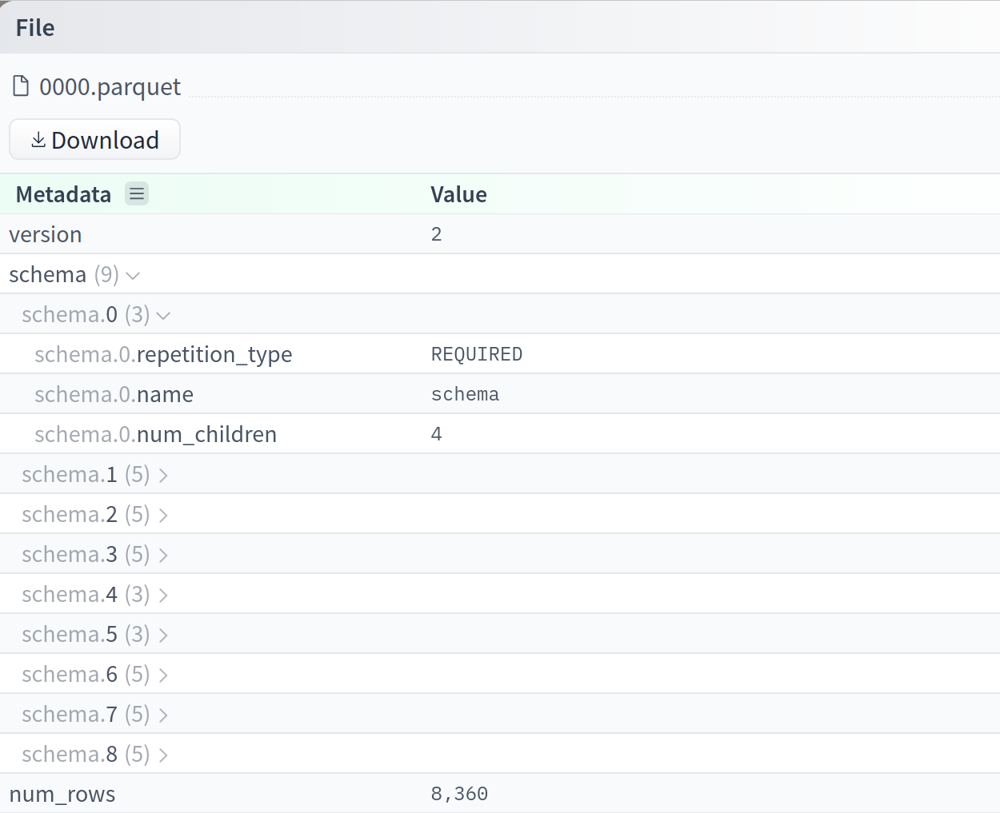

In 2024, I developed a Parquet metadata viewer for Hugging Face, allowing users to easily inspect the metadata of their Parquet files. The tool reuses the viewer for GGUF model format metadata. It uses Svelte on the frontend, and hyparquet on the backend to parse the Parquet files.

